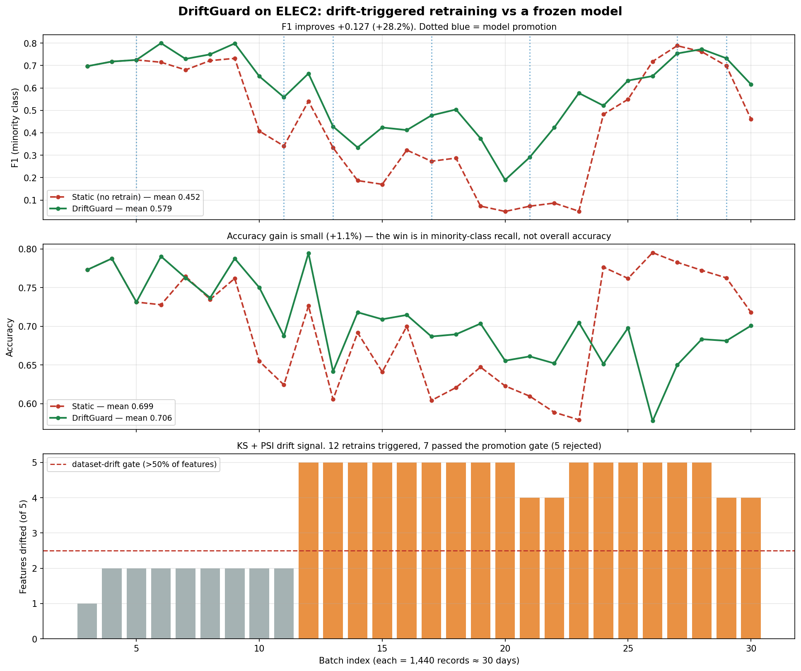
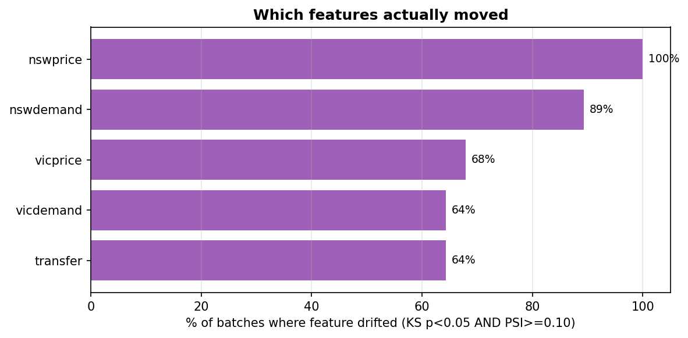

# DriftGuard

Automated drift detection and gated model retraining, evaluated on a real
concept-drift benchmark against a no-retraining control.

[](https://github.com/ISHANSHIRODE01/DriftGuard-ML/actions/workflows/ci.yml)


---

## The problem

A deployed model does not fail loudly. It keeps returning predictions with
full confidence while the world underneath it changes, and nothing in the
serving stack notices. By the time a business metric moves, the model has been
wrong for weeks.

DriftGuard watches the incoming data distribution and the model's live
performance, retrains when either degrades, and refuses to promote the
retrained model unless it demonstrably wins.

## Result

Measured on **ELEC2** (45,312 records, 31 chronological batches), comparing a
frozen model against DriftGuard over the same 28 evaluation batches:

| Metric | Static model | DriftGuard | Change |
|---|---|---|---|
| Mean F1 (minority class) | 0.4515 | **0.5789** | **+28.2%** |
| Mean accuracy | 0.6988 | 0.7064 | +1.1% |
| Batches won | 8 | **17** | 3 tied |
| Retrains triggered | — | 12 | — |
| Challengers promoted | — | 7 | 5 rejected by gate |



**The honest read: accuracy barely moved (+1.1%) while F1 rose 28%.** That gap
is the actual finding. As the data drifted, the stale model collapsed toward
predicting the majority class — it stayed superficially accurate while losing
the ability to identify the minority class at all, bottoming out near F1 0.05
around batches 20–23. Retraining restored minority-class recall. Reporting only
accuracy on this problem would have hidden a near-total failure.

Note batch 26, where the static model beats DriftGuard on accuracy. Retraining
on a recent window is not a free win: a shorter window means less data and
higher variance. That trade-off is visible in the chart rather than smoothed
away.



`nswprice` drifted in **28 of 28** batches — consistent with the documented
regime change in the NSW electricity market that makes ELEC2 a drift benchmark
in the first place.

## Dataset

**ELEC2** (Harries, 1999) — half-hourly records from the New South Wales
electricity market, labelled with whether the spot price rose or fell relative
to a 24-hour moving average. Market rules changed partway through collection,
so the feature→label relationship genuinely shifts. This matters: a drift
system validated on synthetic noise proves nothing about real drift.

Batches are strictly chronological (1,440 records ≈ 30 days). Shuffling would
leak future information backwards and invalidate the entire experiment.

## How the decision works

**Retrain trigger** — fires on *either* signal:

1. **Distribution drift** — >50% of monitored features fail a two-sample
   Kolmogorov-Smirnov test at p < 0.05 **and** show PSI ≥ 0.10.
2. **Performance breach** — batch accuracy falls >5 points below the
   champion's validation accuracy.

Both are needed. Distribution drift alone can be harmless if the model barely
uses the shifted feature. Performance drops can occur with no measurable
feature drift, when only the feature→label relationship changed. Monitoring
one signal misses half the failure modes.

**Why PSI gates the KS test:** KS is sensitive to sample size. At 45k rows a
0.02 mean shift is "statistically significant" and operationally irrelevant.
PSI is an effect size, independent of n, so requiring both stops the detector
alerting on every batch. `tests/test_drift_detector.py` covers this directly.

**Promotion gate** — the challenger must beat the champion by ≥1 point on the
*same* unseen batch. Both models are scored on identical data; comparing a
challenger's fresh validation score against the champion's months-old score
would rig the contest. 5 of 12 retrains were rejected here — without the gate
those would have been 5 unnecessary model swaps, each destroying the ability
to attribute a later regression to anything.

A cool-down of 2 batches between retrains prevents thrashing during sustained
drift.

## Architecture

```
ELEC2 stream (chronological batches)
        │
        ▼
┌───────────────────┐     ┌──────────────────────────┐
│ DriftDetector     │────▶│ Postgres                 │
│ KS · Chi² · PSI   │     │  model_versions          │
└───────────────────┘     │  drift_runs              │
        │                 │  feature_drift           │
        ▼                 │  predictions             │
┌───────────────────┐     └──────────────────────────┘
│ DriftMonitor      │                 ▲
│ trigger → retrain │                 │
│ → promotion gate  │─────────────────┘
└───────────────────┘
        │                 ┌──────────────────────────┐
        ├────────────────▶│ MLflow (params/metrics)  │
        │                 └──────────────────────────┘
        ▼
┌───────────────────┐     ┌──────────────────────────┐
│ FastAPI /predict  │     │ Streamlit dashboard      │
└───────────────────┘     └──────────────────────────┘
```

The schema is normalised so "which model was serving when feature X drifted?"
is one SQL join instead of a filesystem hunt.

## Quickstart

```bash
pip install -r requirements.txt
python scripts/download_data.py          # fetch ELEC2 -> data/elec2.csv
python experiments/run_experiment.py     # both arms, writes reports/
python experiments/make_charts.py        # regenerate figures
pytest tests/ -v                         # 29 tests
```

Full stack with Postgres:

```bash
docker compose up --build
# API       http://localhost:8000/docs
# Dashboard http://localhost:8501
```

## API

```bash
curl -X POST localhost:8000/predict -H 'Content-Type: application/json' -d '{
  "records": [{"nswprice":0.05,"nswdemand":0.42,"vicprice":0.003,
               "vicdemand":0.42,"transfer":0.41,"period":0.5,"day":3}]}'
```

```json
{"model_version": 13, "n_records": 1, "latency_ms": 69.19,
 "predictions": [{"prediction": 1, "probability_up": 0.5087}]}
```

| Endpoint | Purpose |
|---|---|
| `GET /health` | Liveness + serving model version |
| `POST /predict` | Score records with the champion |
| `GET /monitoring/timeline` | Drift and performance history |
| `GET /monitoring/features` | Feature drift frequency ranking |
| `GET /models` | Model registry |

## Stack

Python · scikit-learn · SciPy · SQLAlchemy · Postgres · MLflow · FastAPI ·
Streamlit · Plotly · Docker Compose · pytest · GitHub Actions

## Limitations

Stated plainly, because these bound what the result means:

- **Labels are assumed immediately available.** Real deployments get labels
  late or never. Practical systems need proxy signals or delayed-label
  evaluation; this uses the benchmark's ground truth.
- **RandomForest only.** No architecture search. The question studied is
  *when to retrain*, not which model is best.
- **A 6-batch retrain window is a hand-tuned constant.** Adaptive windowing
  (ADWIN, KSWIN) would likely do better and is the obvious next step.
- **One dataset.** Results on ELEC2 do not automatically transfer to other
  drift patterns. Airlines and Covertype would be the next benchmarks.
- **Single-node.** No distributed training, no async serving, no autoscaling.

## Next

- ADWIN / KSWIN adaptive drift detection from `river`, benchmarked against
  the fixed-window approach here
- Delayed-label simulation to test behaviour under realistic feedback lag
- Per-feature attribution of performance loss, not just distribution shift
- Shadow deployment so a challenger serves live traffic before promotion

## License

MIT
