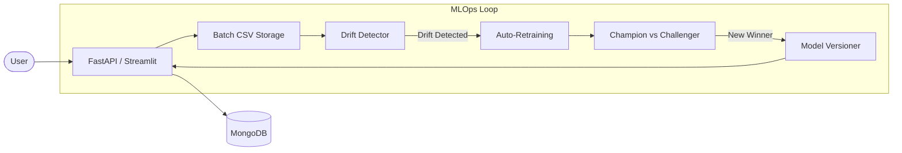

# 🛡️ DriftGuard-ML: Production-Grade Student Performance Monitor

[](https://www.python.org/)
[](https://fastapi.tiangolo.com/)
[](https://www.mongodb.com/)
[](https://streamlit.io/)

**DriftGuard-ML** is an end-to-end MLOps system built to predict academic performance while proactively managing model decay through automated statistical drift detection and safe champion-challenger retraining.

---

## 🚩 Problem Statement
In production ML, **Data Drift** is the silent killer. As student demographics, school environments, and external socio-economic factors change, models trained on static datasets quickly lose accuracy. 

Most systems fail because they lack:
1.  **Visibility:** No way to see when the data distribution shifts.
2.  **Automation:** Manual retraining is slow and error-prone.
3.  **Safety:** Updating a model can introduce regressions if not properly validated.

## 💡 The Solution
DriftGuard-ML solves these challenges by wrapping a high-performance `RandomForest` regressor in a robust MLOps framework that automates the entire lifecycle: **Inference -> Logging -> Monitoring -> Retraining -> Promotion.**

---

## ✨ Key Features
*   🚀 **High-Performance API:** FastAPI-powered inference serving with sub-50ms latency.
*   📡 **Statistical Drift Detection:** Automated KS-Tests and Chi-Square analysis to detect feature shifts.
*   🔄 **Champion-Challenger Pipelines:** Automated retraining that only promotes the "Challenger" model if it earns a significant accuracy boost.
*   📊 **Executive Dashboard:** Live Streamlit UI for monitoring model health, drift reports, and historical performance.
*   🗄️ **Full Audit Trail:** Every prediction, drift report, and model version is logged to MongoDB.
*   🔒 **Safe Versioning:** Atomic model swapping with thread-safe file locks for zero-downtime updates.

---

## 🏗️ System Architecture



---

## 🛠️ Tech Stack
*   **Core:** Python, Scikit-Learn, Pandas.
*   **Infrastructure:** MongoDB (Atlas/Local) for metadata and logging.
*   **Serving:** FastAPI (REST API), Streamlit (Dashboard).
*   **Stats Engine:** SciPy (KS-Test, Chi-Square).
*   **Tooling:** Joblib (Serialization), Pydantic (Validation).

---

## 📋 Dataset & Model
*   **Dataset:** UCI Student Performance Research Data (Mathematics).
*   **Task:** Regression (Predicting Final Grade `G3` on a 0-20 scale).
*   **Model:** Random Forest Regressor (tuned for robustness).
*   **Primary Metric:** Mean Absolute Error (MAE).

---

## 🚀 How to Run Locally

### 1. Prerequisite: MongoDB
Ensure you have MongoDB running locally or a connection string ready.

### 2. Installation
```bash
git clone https://github.com/yourusername/DriftGuard-ML.git
cd DriftGuard-ML
pip install -r requirements.txt
```

### 3. Setup Environment
Create a `.env` file:
```env
MONGO_URI=mongodb://localhost:27017
DB_NAME=drift_guard_db
```

### 4. Launch the Dashboard
```bash
streamlit run dashboard/dashboard.py
```

### 5. Start the API
```bash
uvicorn api.app:app --reload
```

---

## 🔮 Future Improvements
*   [ ] **A/B Testing:** Simultaneously serve multiple models to live traffic.
*   [ ] **CI/CD Integration:** Automate the pipeline triggers using GitHub Actions.
*   [ ] **Cloud Native:** Deploy using Docker and Kubernetes for horizontal scaling.

---

## 👩‍💻 Author
**[Your Name]** - Senior ML Engineer / MLOps Expert
*   [LinkedIn](your-profile-url)
*   [Portfolio](your-portfolio-url)
