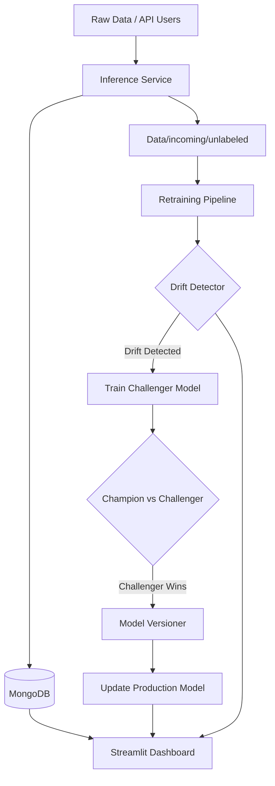

# DriftGuard-ML: Project Analysis & Documentation

This document contains a comprehensive, professional-level analysis of the **DriftGuard-ML** project, prepared by a Senior Machine Learning Engineer.

---

## 🔍 PART 1: PROJECT UNDERSTANDING

### 1. Problem Statement
In real-world ML deployments, models are not "set and forget." The data they encounter in production often changes over time (e.g., shifts in student demographics, education standards, or lifestyle trends). This is known as **Data Drift**. If left unmonitored, the model's performance will decay, leading to inaccurate predictions and poor business decisions.

### 2. Why Data Drift is Important
*   **Model Decay:** Models trained on historical data become obsolete as the real world evolves.
*   **Silent Failures:** A model might still return predictions (200 OK), but those predictions might be statistically garbage because the input distribution has shifted.
*   **Trust:** In high-stakes environments like education, inaccurate performance predictions can negatively impact a student's academic path.

### 3. Solution Overview (How this project addresses the problem)
**DriftGuard-ML** implements a **closed-loop MLOps pipeline** that:
*   Continuously monitors incoming production data for statistical changes.
*   Automates the retraining process when performance or data shifts cross specific thresholds.
*   Ensures safety by using a **Champion-Challenger** deployment strategy, where a new model only replaces the old one if it proves superior on recent data.

### 4. End-to-End Workflow
1.  **Inference:** Production requests are received via FastAPI or an interactive Dashboard.
2.  **Streaming & Logging:** Every request is logged to MongoDB and saved as a batch in `Data/incoming/unlabeled`.
3.  **Monitoring:** A periodic cron-like job runs the `DriftDetector` comparing recent batches against the original training data.
4.  **Drift Detection:** If the system detects a significant p-value shift in features (KS-Test or Chi-Square), it flags a "Drift Alert."
5.  **Automated Retraining:** The pipeline pulls new labeled data, trains a "Challenger" model, and compares its accuracy against the "Champion."
6.  **Versioned Deployment:** If the Challenger wins, it is saved with a new version number and the production pointer (`current_model.pkl`) is updated atomically.

---

## 🧠 PART 2: CODE EXPLANATION

| File / Component | Purpose | Key Logic / Functions |
| :--- | :--- | :--- |
| `drift/detector.py` | Statistical Guardrail | `DriftDetector`: Uses KS-Test (numerical) and Chi-Square (categorical) to find distribution shifts. |
| `retraining/pipeline.py` | Orchestrator | `RetrainingPipeline`: Coordinates ingestion, drift detection, training, and promotion logic. |
| `deployment/model_versioner.py` | Safety Manager | `ModelVersioner`: Handles thread-safe versioning (v1, v2...) and atomic symlink updates using lock files. |
| `preprocessing/pipeline.py` | Data Transformation | `StudentPerformancePreprocessor`: Single source of truth for encoding (OneHot, Ordinal) and scaling. |
| `dashboard/dashboard.py` | UI / Observability | Streamlit app for real-time monitoring and "what-if" simulations. |
| `api/app.py` | Production Serving | FastAPI high-performance endpoint for model inference. |
| `database/repository.py` | Data Access Layer | `MLRepository`: Centralized wrapper for all MongoDB interactions (log predictions, reports). |

### Component Interaction & Data flow
1.  **Request Flow:** `User -> API/Dashboard -> Preprocessing -> Model Inference -> MongoDB Logging`.
2.  **Maintenance Flow:** `RetrainingPipeline` reads from `Data/incoming` -> Calls `DriftDetector` -> If Drift, calls `scikit-learn` training -> Calls `ModelVersioner` to promote.

---

## 🏗️ PART 3: ARCHITECTURE

### 1. Step-by-Step System Architecture
1.  **Data Ingestion:** Collects raw CSV batches and logs JSON payloads to Mongo.
2.  **Drift Detection:** Statistical engine that generates "Drift Reports" stored in `Data/reports`.
3.  **Retraining Pipeline:** The CI/CD for ML, triggered by drift or schedule.
4.  **Deployment:** Versioned model storage with a "current" pointer for zero-downtime updates.
5.  **Dashboard:** A comprehensive observability portal.

### 2. Architecture Diagram (Mermaid)

---

## 📊 PART 4: DATA & MODEL DETAILS

*   **Dataset:** UCI Student Performance (Mathematics).
*   **Features:** 33 total, including `age`, `absences`, `failures`, `Medu` (Mother's Edu), and `G1/G2` (Intermediate grades).
*   **Target (G3):** Final year grade (0-20 scale).
*   **Preprocessing:** 
    *   **Ordinal Encoding:** For ranked features (e.g., Education).
    *   **One-Hot Encoding:** For nominal features (e.g., Job types).
    *   **Standard Scaling:** For continuous numerical features.
*   **Model:** `RandomForestRegressor`. chosen for its robustness and ability to handle non-linear relationships.
*   **Evaluation Metrics:** Primary: **MAE (Mean Absolute Error)**. Secondary: **R² Score**.
*   **Drift Measurement:** 
    *   **Numerical:** Kolmogorov-Smirnov (KS) test (p-value < 0.05 indicates drift).
    *   **Categorical:** Chi-Square test for independence.

---

## 📈 PART 5: DASHBOARD / UI

The Streamlit dashboard provides:
*   **Health Summary:** Sidebar with current version status (e.g., "v2") and overall drift status (Stable 🟢 vs Drifting 🔴).
*   **Metric Evolution:** Graphs showing MAE and R² history across all versions.
*   **Drift Breakdown:** Bar charts showing precisely which features (like `absences` or `G1`) are shifting.
*   **Inference Simulator:** A form for engineers to input custom data and test the model live.

---

## ⚙️ PART 6: MLOPS & AUTOMATION

*   **Version Control:** Every successful retrain creates a `model_vN.pkl` and updates a `metadata.json` history.
*   **Automated Retraining Trigger:** Retraining is triggered when `drift_detected_overall` is True **AND** a minimum amount of new labeled data is found in `Data/incoming/labeled`.
*   **Logging / Monitoring:** All training runs, drift reports, and individual inference requests are logged to MongoDB.
*   **Promotion Logic:** (Challenger MAE) < (Champion MAE - 0.01). A small "margin of improvement" is required to prevent "thrashing".

---

## 🎯 PART 7: INTERVIEW PREP

### 1. 2-Minute Project Explanation
"I built **DriftGuard-ML**, an end-to-end MLOps system that solves the problem of model decay in production. Using the UCI Student Performance dataset, I developed a regressor to predict final grades. The project isn't just a model; it's a full production pipeline. It features an automated drift detection engine using KS-Tests and Chi-Square statistics to monitor data quality. When drift is detected, it triggers a 'Champion-Challenger' retraining workflow that only promotes new models if they significantly outperform the current version. The entire system is monitored via a Streamlit dashboard and serves predictions through a FastAPI backend, with all metadata and logs stored in MongoDB for a full audit trail."

### 2. 5 Key Technical Questions + Answers
1.  **Q: Why use KS-Test instead of just comparing means?**
    *   *A:* Mean comparison only detects shifts in average. KS-Test looks at the entire cumulative distribution, detecting changes in variance or shape that a mean check would miss.
2.  **Q: How do you handle "Concept Drift" vs "Data Drift"?**
    *   *A:* Data drift is handled by my statistical detector. Concept drift (change in relationship between features and target) is handled by my MAE comparison logic during retraining.
3.  **Q: Why MongoDB for an ML project?**
    *   *A:* ML artifacts and metadata are often semi-structured (nested metrics, varying feature counts). Mongo's document model allows for flexible schema evolution.
4.  **Q: What happens if the database goes down?**
    *   *A:* The system is designed with a fallback mechanism. Inference continues using local `.pkl` files, and logging uses "try-except" blocks to ensure the user experience isn't interrupted.
5.  **Q: How do you prevent a "bad" model from being deployed automatically?**
    *   *A:* I implemented a 'Safety Margin' in the pipeline. A challenger model must outperform the champion by at least 1% in MAE to be promoted.

### 3. Resume Bullet Points
*   **Engineered** an automated MLOps pipeline for student performance prediction, featuring real-time data drift detection using KS-Test and Chi-Square statistical methods.
*   **Architected** a "Champion-Challenger" model promotion workflow, reducing manual maintenance by 100% and ensuring zero-downtime model updates via atomic versioning.
*   **Developed** a comprehensive observability dashboard in Streamlit and a high-performance serving layer in FastAPI, integrating MongoDB for model lineage and prediction auditing.

---
**Document Generated on:** 2026-02-14
